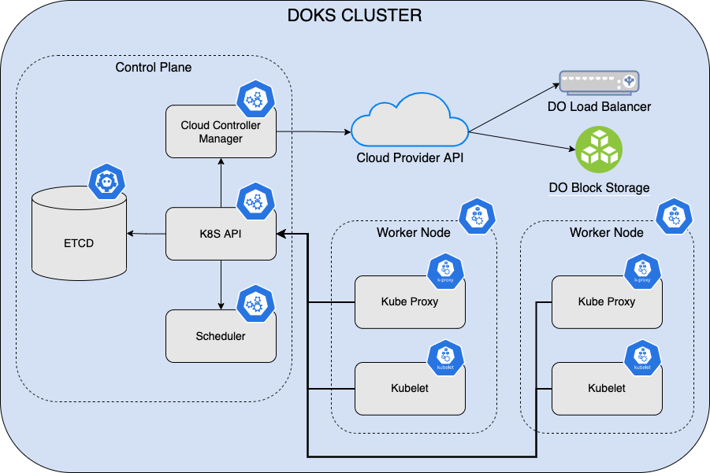
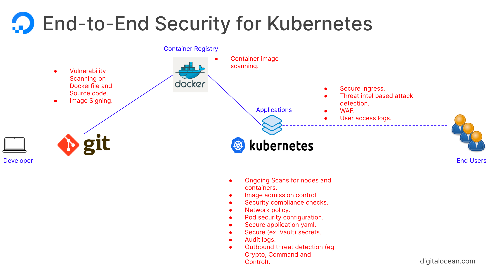

# DigitalOcean Kubernetes (DOKS) Hardening Guide

## Introduction

This guide provides a short introduction about Kubernetes security best practices in general (applies to [DOKS](https://docs.digitalocean.com/products/kubernetes/) as well). Then, a practical example is given about how to integrate a vulnerability scan tool ([Trivy](https://github.com/aquasecurity/trivy/)) in a traditional CI/CD pipeline implemented using [Tekton](https://tekton.dev).

[Kubernetes](https://kubernetes.io) gained a lot of popularity over time and for a good reason. It's widely being used today in every modern infrastructure based on microservices. Kubernetes takes away the burden of managing high availability (or HA) setups, such as scheduling and replicating workloads on different nodes, thus assuring resiliency. Then, at the networking layer it also takes care of load balancing and distributes traffic evenly to workloads. At its core, Kubernetes is a modern container scheduler offering additional features such as application configuration and secrets management, to mention a few. You can also set quotas and control applications access to various resources (such as CPU and memory) by fine tuning resource limits requests. In terms of security, you can restrict who has access to what resources via RBAC, which is an acronym standing for Resource Based Access Control.

Kubernetes has grown a lot in terms of stability and maturity in the past years. On the other hand, it has become a more complex ecosystem by leveraging more functional components. No matter where you run Kubernetes clusters (cloud or on-premise), at its core Kubernetes is divided into two major components:

1. [Control Plane](https://kubernetes.io/docs/concepts/overview/components/#control-plane-components) - takes care of scheduling your workloads (Pods) and responding to cluster events (such as starting up a new pod when a deployment's replicas field is unsatisfied).
2. [Worker Nodes](https://kubernetes.io/docs/concepts/overview/components/#node-components) - these are the actual machines running your Kubernetes workloads. Node components run on every node, maintaining running pods and providing the Kubernetes runtime environment.

Below picture shows the typical architecture of a Kubernetes cluster:



Cloud providers (including [DigitalOcean](https://www.digitalocean.com)) offer today ready to run [Kubernetes](https://docs.digitalocean.com/products/kubernetes/) solutions thus taking away the burden of managing the cluster itself (or the control plane component). This way, you can focus more on application development rather than spending precious time to deal with infrastructure tasks, such as maintaining the control plane components (e.g. ETCD database backups), worker nodes maintenance (e.g. performing regular OS updates and security patching), etc. DigitalOcean offers an easy to use Kubernetes platform called [DOKS](https://docs.digitalocean.com/products/kubernetes/), which stands for DigitalOcean Kubernetes. DOKS is a [managed Kubernetes](https://docs.digitalocean.com/products/kubernetes/resources/managed/) service that lets you deploy Kubernetes clusters without the complexities of handling the control plane and containerized infrastructure.

Going further, a very important aspect which is often overlooked is **security**. Security is a broader term and covers many areas such as: application supply chain security, infrastructure, networking, etc. Because Kubernetes is such popular nowadays it is a potential target so care must be taken. Another aspect to look at is the Kubernetes ecosystem complexity. In general, complex systems can have multiple weak points, thus opening doors to external attacks and exploits. Most of the security flaws are caused by improperly configured Kubernetes clusters. A typical example is cluster administrators forgetting to set RBAC rules, or allowing applications to run as root in the Pod specification. Going further, Kubernetes offers a simple but very powerful isolation mechanism (both at the application level and networking layer) - [Namespaces](https://kubernetes.io/docs/concepts/overview/working-with-objects/namespaces/). By using namespaces administrators can isolate application resources and configure access rules to various users and/or teams in a more controlled fashion.

Approaching Kubernetes security is a multi step process, and usually consists of:

1. Hardening the Control Plane:
   - Reduce surface attacks by securing the public REST API of Kubernetes (authorization, authentication, TLS encryption).
   - Regularly update the operating system kernel (Linux) to include security fixes. Also, system libraries and binaries must be updated and patched regularly.
   - Enforce network policies and configure firewalls to allow minimum to zero access if possible from the outside. Start by denying everything, and then allow only required services. **Do not expose the ETCD database publicly!**
   - Restrict access to a very limited group of people (system administrators usually).
   - Perform system checks regularly by installing/configuring an audit tool, and receive alerts in real time in case of a security breach.
2. Hardening Worker Nodes. Most of the control plane recommendations apply here as well, with a few notes such as:
   - Never expose [kubelets](https://kubernetes.io/docs/reference/command-line-tools-reference/kubelet/) or [kube-proxies](https://kubernetes.io/docs/reference/command-line-tools-reference/kube-proxy/) publicly.
   - Avoid exposing the SSH service to the public. This is recommended to reduce surface attacks. For system administration you can use a VPN setup.
3. Hardening the Kubernetes environment:
   - Strict permissions for Pods and containers (such as not allowing root user within Pod spec, immutable filesystems for containers, etc.)
   - Proper configuration of RBAC policies.
   - Setting up admission controllers to allow running trusted containers only.
   - Network policies and namespace isolation (restrict applications to dedicated namespaces, as well as controlling ingress/egress traffic between namespaces).
4. Hardening the application supply chain:
   - Application source code and 3rd party libraries scanning for known vulnerabilities.
   - Application container images scanning for known vulnerabilities.
   - Kubernetes YAML manifests scanning for known vulnerabilities.

In case of DOKS, you don't have to worry about control plane and worker nodes security because this is already taken care by the cloud provider (DigitalOcean). That's one of the main reasons it is called a managed Kubernetes service. Still, users have access to the underlying machines (Droplets) and firewall settings, so it all circles back to administrators diligence to pay attention and not expose services or ports that are not really required.

What's left is taking measures to harden the Kubernetes applications supply chain, hence this guide main focus is around that area.

## Table of Contents

- [Introduction](#introduction)
- [Table of Contents](#table-of-contents)
- [Requirements](#requirements)
- [Kubernetes Applications Supply Chain Security](#kubernetes-applications-supply-chain-security)
- [Getting to Know Trivy Scanner](#getting-to-know-trivy-scanner)
- [Example Tekton CI/CD Pipeline Implementation using Trivy Scanner](#example-tekton-cicd-pipeline-implementation-using-trivy-scanner)

## Requirements

To complete all steps from this guide, you will need:

1. A working `DOKS` cluster running `Kubernetes version >=1.21` that you have access to. The DOKS cluster must have at least `2 nodes`, each with `2 CPUs`, `4 GB` of memory, and `5 GB` of disk storage for PVCs. For additional instructions on configuring a DigitalOcean Kubernetes cluster, see: [How to Set Up a DigitalOcean Managed Kubernetes Cluster (DOKS)](https://github.com/digitalocean/Kubernetes-Starter-Kit-Developers/tree/main/01-setup-DOKS#how-to-set-up-a-digitalocean-managed-kubernetes-cluster-doks).
2. [Tekton 1-click application](https://marketplace.digitalocean.com/apps/tekton-pipelines) installed in your DOKS cluster for the CI part.
3. [ArgoCD 1-click application](https://marketplace.digitalocean.com/apps/argocd) installed in your DOKS cluster for the CD part.
4. A [Git](https://git-scm.com/downloads) client to interact with GitHub repositories.
5. [Kubectl](https://kubernetes.io/docs/tasks/tools) CLI for `Kubernetes` interaction. Follow these [instructions](https://www.digitalocean.com/docs/kubernetes/how-to/connect-to-cluster/) to connect to your cluster with `kubectl` and `doctl`.
6. [Argo CLI](https://argo-cd.readthedocs.io/en/stable/cli_installation) to interact with `Argo CD` using the command line interface.
7. [Tekton CLI](https://tekton.dev/docs/cli/#installation) to interact with `Tekton Pipelines` using the command line interface.
8. [Trivy CLI](https://aquasecurity.github.io/trivy/v0.29.2/getting-started/installation/) to interact with [Trivy](https://aquasecurity.github.io/trivy/v0.29.2) vulnerabilities scanner.

## Kubernetes Applications Supply Chain Security

To build an application and run it on Kubernetes, you need a list of ingredients which are part of the so called application supply chain. The application supply chain is usually composed of:

- A Git repository from where your application source code is retrieved.
- Third party libraries that your application may use (fetched via a project management tool, such as npm, maven, gradle, etc).
- Docker images hosting your application (including inherited base images).
- YAML manifests that tell Kubernetes to create required resources for your application to run, such as Pods, Secrets, PVs, etc.

Hardening the Kubernetes applications supply chain can be accomplished at the CI/CD pipeline level. Every modern infrastructure is using a CI/CD system nowadays to push applications in a production environment, hence it makes sense to do so.

Below picture illustrates the concept better:



There are many vulnerability scanning tools available but this guide is particularly focusing on [Trivy](https://github.com/aquasecurity/trivy/) from [Aqua Security](https://www.aquasec.com).

## Getting to Know Trivy Scanner

[Trivy](https://github.com/aquasecurity/trivy/) is a comprehensive vulnerability scanner for containers, OS packages, and language-specific packages (Bundler, Composer, npm, yarn, etc.). In addition, Trivy is able to scan Kubernetes manifests to detect potential configuration issues that expose your deployments to the risk of attack. Trivy also scans hardcoded secrets like passwords, API keys and tokens.

Trivy detects the following security issues:

- [Vulnerabilities](https://aquasecurity.github.io/trivy/v0.29.2/docs/vulnerability/scanning/)
- [Misconfigurations](https://aquasecurity.github.io/trivy/v0.29.2/docs/misconfiguration/scanning/)

Trivy can scan the following type of artifacts:

- [Container Images](https://aquasecurity.github.io/trivy/v0.29.2/docs/vulnerability/scanning/image/)
- [Filesystem](https://aquasecurity.github.io/trivy/v0.29.2/docs/vulnerability/scanning/filesystem/) and [Rootfs](https://aquasecurity.github.io/trivy/v0.29.2/docs/vulnerability/scanning/rootfs/)
- [Git Repositories](https://aquasecurity.github.io/trivy/v0.29.2/docs/vulnerability/scanning/git-repository/)
- [Kubernetes](https://aquasecurity.github.io/trivy/v0.29.2/docs/kubernetes/cli/scanning/)

Trivy can be run in two different modes:

- [Standalone](https://aquasecurity.github.io/trivy/v0.29.2/docs/references/modes/standalone/)
- [Client/Server](https://aquasecurity.github.io/trivy/v0.29.2/docs/references/modes/client-server/)

You can visit the [official documentation site](https://aquasecurity.github.io/trivy/v0.29.2/docs/) for more information about Trivy and available features.

Trivy client (or CLI) is designed to be run in a CI/CD environment such as Tekton. [Trivy Scanner Tekton Task](https://hub.tekton.dev/tekton/task/trivy-scanner/) is available for installation from [Tekton Hub](https://hub.tekton.dev).

Some examples to try with Trivy CLI:

- Scan a full cluster and generate a simple summary report:

   ```shell
   trivy k8s --report=summary cluster
   ```

- Scan a specific namespace:

   ```shell
   trivy k8s -n kube-system --report=summary all
   ```

You can find more examples in the [Trivy CLI documentation page](https://aquasecurity.github.io/trivy/v0.29.2/docs/kubernetes/cli/scanning/). In the next step you will learn how to integrate Trivy CLI into a Tekton CI/CD pipeline to demonstrate its functionality.

## Example Tekton CI/CD Pipeline Implementation using Trivy Scanner

TBD
